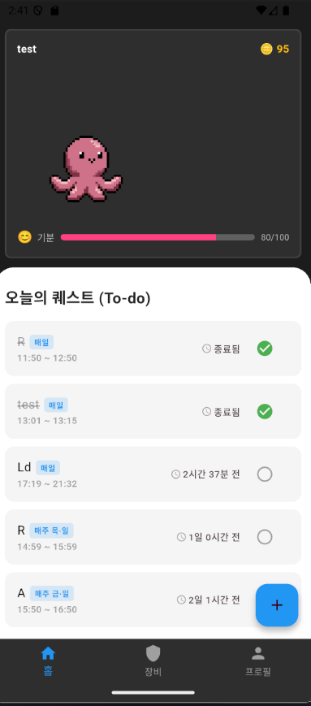
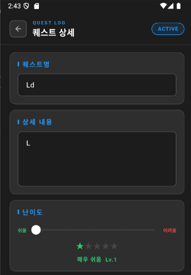
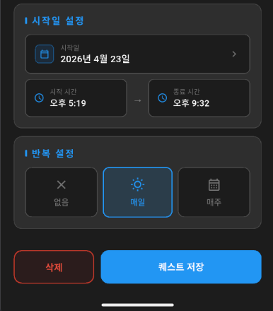
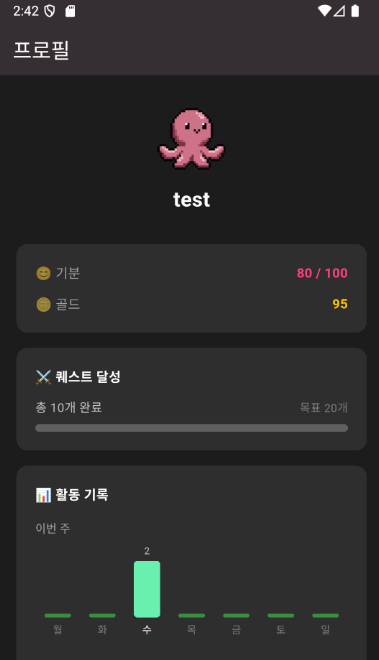
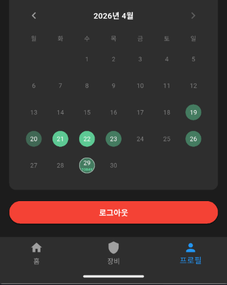

# andone 🐙

> 할 일을 완료하며 나만의 문어 캐릭터를 키우는 **다마고치 스타일 Todo 앱**

## 📌 기획 배경

사람들이 Todo를 등록해도 실제로 완료하지 않는 경우가 많다는 점에 주목했습니다.  
단순한 체크리스트로는 지속적인 실행을 이끌어내기 어렵다고 판단해,  
**다마고치 방식의 캐릭터 육성**을 통해 Todo 완료에 대한 동기부여를 제공하는 앱을 기획했습니다.

퀘스트(Todo)를 완료할수록 캐릭터의 기분이 올라가고, 골드를 획득해 캐릭터를 꾸밀 수 있습니다.

---

## 📸 스크린샷

|                          홈                          |                         Todo 상세 (1)                         |                         Todo 상세 (2)                         |                        프로필 (1)                         |                        프로필 (2)                         |
| :--------------------------------------------------: | :-----------------------------------------------------------: | :-----------------------------------------------------------: | :-------------------------------------------------------: | :-------------------------------------------------------: |
|  |  |  |  |  |

---

## 📱 주요 기능

### ✅ Todo (퀘스트)

- 퀘스트 생성 / 수정 / 삭제
- 난이도 설정 (1~5단계) — 완료 시 난이도별 골드 지급 (10~50골드)
- 반복 설정 (없음 / 매일 / 매주 요일 지정)
- 시작일 및 시간 범위 설정
- 완료 처리 (완료 후 취소 불가)
- 오늘 날짜 기준 퀘스트 자동 필터링
- 마감 **30분 전 로컬 알림** 자동 스케줄링

### 🐙 캐릭터 시스템

- 문어 픽셀 아트 캐릭터 (좌우 유영 애니메이션)
- 기분 수치 (0~100) — 퀘스트 완료 시 상승, 전날 미완료 시 감소
- 기분 수치에 따라 표정 스프라이트 변경 (기쁨 / 슬픔)
- 골드 — 난이도에 따라 퀘스트 완료 시 획득

### 👤 계정

- 이메일/비밀번호 회원가입 (닉네임 포함)
- 로그인 / 로그아웃
- 계정별 독립적인 데이터 관리

### 📊 프로필

- 기분 / 골드 스탯 표시
- 누적 퀘스트 달성 수 + 마일스톤 진행도
- 이번 주 요일별 달성 막대 그래프
- 월별 달성 캘린더 (탭하면 달성 수 표시)

### 🗂️ 탭 구성

| 탭     | 설명                             |
| ------ | -------------------------------- |
| 홈     | 문어 캐릭터 + 오늘의 퀘스트 목록 |
| 장비   | 꾸미기 아이템 (아이템 추가 예정) |
| 프로필 | 스탯, 활동 기록, 로그아웃        |

---

## 🛠️ 기술 스택

| 항목      | 내용                                            |
| --------- | ----------------------------------------------- |
| Framework | Flutter 3.35.4 / Dart 3.9.2                     |
| 상태관리  | Flutter Riverpod ^3.2.1 (NotifierProvider 패턴) |
| 인증      | Firebase Auth ^6.1.4                            |
| DB        | Cloud Firestore ^6.1.2                          |
| 알림      | flutter_local_notifications                     |
| 아키텍처  | MVVM                                            |

---

## 💡 기술적 구현 포인트

### 반복 Todo 시간 계산 로직

매주 반복 Todo에서 다음 실행 요일까지 남은 시간을 동적으로 계산합니다.  
남은 시간이 24시간을 초과할 경우 `n일 nn시간` 형식으로 표시합니다.

### 캐릭터 기분 수치 시스템

`completedHistory` 컬렉션을 기반으로 전날 퀘스트 완료 여부를 체크합니다.  
완료 기록이 없으면 앱 실행 시 기분 수치가 자동 감소합니다.

### 반복 Todo 자동 초기화

- 반복 없음: `isCompleted` 필드로 완료 관리
- 매일/매주 반복: `lastCompletedDate` 기반으로 날짜가 바뀌면 자동 초기화
- 매주 반복은 지정된 요일에만 활성화되어 표시

### 로컬 알림 스케줄링

퀘스트 생성/수정 시 `endTime` 기준 30분 전에 로컬 알림을 자동 등록합니다.  
퀘스트 삭제 시 해당 알림도 함께 취소합니다.

### Firebase Auth + GoRouter 라우팅 보호

로그인 상태를 `StreamProvider`로 감지하고, GoRouter의 `redirect`를 통해  
비로그인 사용자의 보호된 페이지 접근을 차단합니다.

---

## 🗄️ Firestore 구조

```
users/
  {uid}/
    ├─ email                    String
    ├─ nickname                 String
    ├─ mood                     int             (0~100)
    ├─ maxMood                  int
    ├─ gold                     int
    ├─ totalCompleted           int
    ├─ lastMoodDecreaseDate     String?         (yyyy-MM-dd, 기분 감소 날짜 중복 방지)
    ├─ ownedItems               List<String>    (보유 아이템 ID 목록)
    ├─ equippedItems            Map<String, String>  ({ "accessory": itemId, "background": itemId })
    │
    ├─ todos/
    │   {todoId}/
    │     ├─ title                   String
    │     ├─ content                 String
    │     ├─ difficulty              int         (1~5)
    │     ├─ startTime               Timestamp
    │     ├─ endTime                 Timestamp
    │     ├─ isCompleted             bool
    │     ├─ repeat                  int         (0=없음, 1=매일, 2=매주)
    │     ├─ repeatDays              List<int>   (1=월 ~ 7=일)
    │     └─ lastCompletedDate       String?     (yyyy-MM-dd)
    │
    └─ completedHistory/
        {yyyy-MM-dd}/
          └─ count                  int

items/                              # 상점 아이템 (전체 공유)
  {itemId}/
    ├─ name             String
    ├─ category         String      ("accessory" | "background")
    ├─ price            int
    ├─ assetPath        String
    ├─ thumbnailPath    String
    └─ description      String
```

---

## 📁 프로젝트 구조

```
lib/
├─ main.dart
├─ auth_service.dart
├─ model/
│   ├─ user_model.dart
│   ├─ todo_model.dart
│   ├─ item_model.dart
│   └─ monster_model.dart
├─ providers/
│   └─ user_provider.dart
├─ services/
│   └─ notification_service.dart
├─ common/                    # 공통 위젯
├─ login_page/
├─ sign_up_page/
├─ main_page/
│   ├─ main_page_view.dart
│   ├─ home_tab_view.dart
│   └─ home_tab_view_model.dart
├─ todo_create_page/
├─ todo_detail_page/
├─ equipment_page/
└─ profile_page/
```

---

## 📲 설치하기

### Android
1. [Releases](https://github.com/AndOne1shot/andone/releases/latest) 페이지에서 `andone.apk` 다운로드
2. 기기 설정 → **출처를 알 수 없는 앱 설치 허용**
3. 다운로드한 APK 파일 실행 후 설치

> iOS는 현재 미지원입니다.


---

## 🗺️ 로드맵

- [x] 반복 Todo 로직 (매일 / 매주 요일 지정)
- [x] 캐릭터 기분 수치 시스템 (완료 시 상승 / 미완료 시 감소)
- [x] 마감 30분 전 로컬 알림
- [x] 캐릭터 표정 변화 (기쁨 / 슬픔 스프라이트)
- [x] 주간/월간 달성 통계
- [x] 꾸미기 시스템 — 상점(아이템 구매) + 꾸미기(장착/해제) 탭 구현
- [x] 전날 완료한 Todo 없을 시 기분 수치 자동 감소
- [ ] 아이템 및 배경 아트 추가
